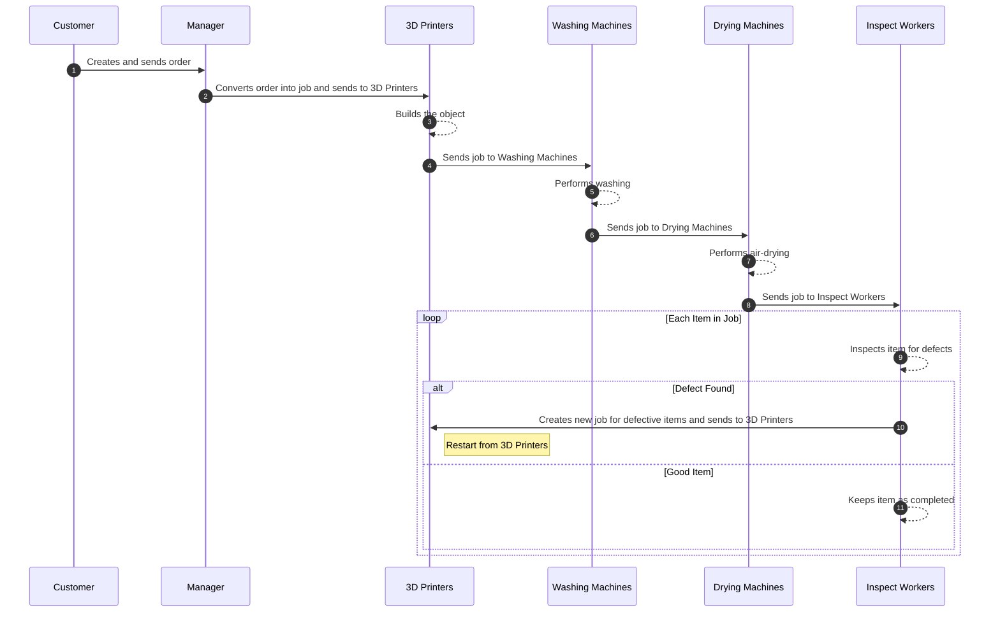

# SimPy based 3D Print Farm

## Operation scenario 

## Problem Description

1. The customer sends an order to the manager that includes patients and the items associated with each patient.

2. The manager converts the order into jobs and forwards those jobs to the 3D printing foundry.

3. The 3D printing foundry processes the jobs in the following sequence: build, washing, drying, and inspection. During the build stage, defects may occur, which are detected during the inspection stage.

4. If the number of defective items exceeds a certain threshold, the foundry sends the defective item information to the manager, who then creates a rework job for those defective items.

5. The results of the simulation can be confirmed through the Gant chart and terminal results.

## Requirements
In the simulator, we utilized simpy library.

## Simulator Process Description
Each process is executed in the following sequence: seize, delay, and release.

* Seize stage:
Jobs stored in the job_store are assigned to the available processors.

* Delay stage:
The actual processing takes place, where the available processors are utilized to process the jobs. Once processed, the jobs are forwarded to the next process, moving them to the release stage.

* Release stage:
The processors that have completed processing are marked as available again, allowing them to handle new jobs.

## Configuration setting
If you want to change the settings of the simulation, you can change the settings through the config_SimPy.py.

## Validation
This link is the validation page of our simulation(3D printing farm) [AIIS_LAB](https://www.notion.so/aiis/3D-printing-farm-professor-version-1bda689291af802093b8c2a052b6b1f8)