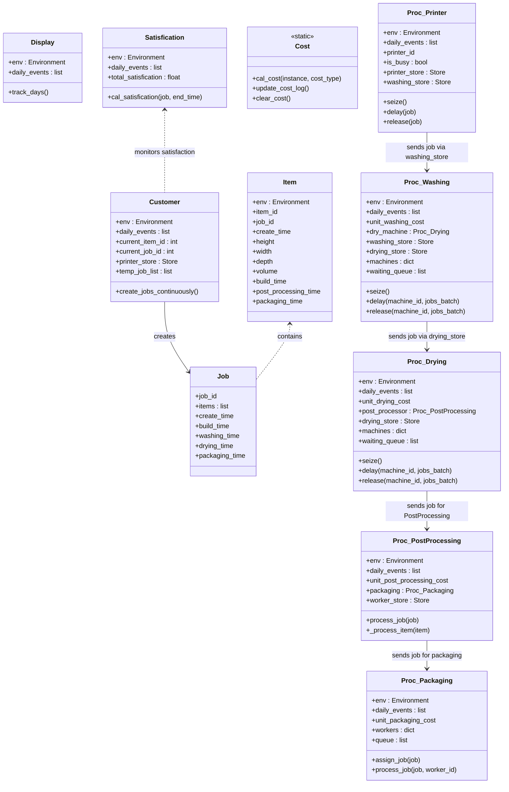

```mermaid
classDiagram
    class Display {
        +env : Environment
        +daily_events : list
        +track_days()
    }
    
    class Job {
        +job_id
        +items : list
        +create_time
        +build_time
        +washing_time
        +drying_time
        +packaging_time
    }
    
    class Customer {
        +env : Environment
        +daily_events : list
        +current_item_id : int
        +current_job_id : int
        +printer_store : Store
        +temp_job_list : list
        +create_jobs_continuously()
    }
    
    class Proc_Printer {
        +env : Environment
        +daily_events : list
        +printer_id
        +is_busy : bool
        +printer_store : Store
        +washing_store : Store
        +seize()
        +delay(job)
        +release(job)
    }
    
    class Proc_Washing {
        +env : Environment
        +daily_events : list
        +unit_washing_cost
        +dry_machine : Proc_Drying
        +washing_store : Store
        +drying_store : Store
        +machines : dict
        +waiting_queue : list
        +seize()
        +delay(machine_id, jobs_batch)
        +release(machine_id, jobs_batch)
    }
    
    class Proc_Drying {
        +env : Environment
        +daily_events : list
        +unit_drying_cost
        +post_processor : Proc_PostProcessing
        +drying_store : Store
        +machines : dict
        +waiting_queue : list
        +seize()
        +delay(machine_id, jobs_batch)
        +release(machine_id, jobs_batch)
    }
    
    class Proc_PostProcessing {
        +env : Environment
        +daily_events : list
        +unit_post_processing_cost
        +packaging : Proc_Packaging
        +worker_store : Store
        +process_job(job)
        +_process_item(item)
    }
    
    class Proc_Packaging {
        +env : Environment
        +daily_events : list
        +unit_packaging_cost
        +workers : dict
        +queue : list
        +assign_job(job)
        +process_job(job, worker_id)
    }
    
    class Item {
        +env : Environment
        +item_id
        +job_id
        +create_time
        +height
        +width
        +depth
        +volume
        +build_time
        +post_processing_time
        +packaging_time
    }
    
    class Cost {
        <<static>>
        +cal_cost(instance, cost_type)
        +update_cost_log()
        +clear_cost()
    }
    
    class Satisfication {
        +env : Environment
        +daily_events : list
        +total_satisfication : float
        +cal_satisfication(job, end_time)
    }
    
    Customer --> Job : creates
    Proc_Printer --> Proc_Washing : sends job via washing_store
    Proc_Washing --> Proc_Drying : sends job via drying_store
    Proc_Drying --> Proc_PostProcessing : sends job for PostProcessing
    Proc_PostProcessing --> Proc_Packaging : sends job for packaging
    Item <.. Job : contains
    Satisfication <.. Customer : monitors satisfaction
```