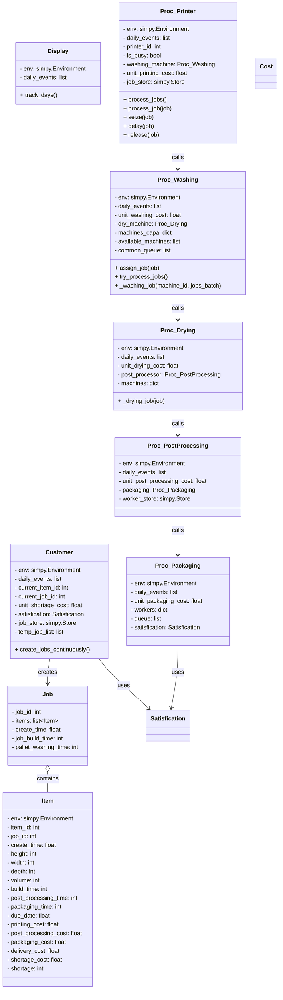

```mermaid
classDiagram
    %% 고객이 Job을 생성하고, Job이 여러 Item을 포함하는 관계를 명시 (composition)
    class Customer {
      - env: simpy.Environment
      - daily_events: list
      - current_item_id: int
      - current_job_id: int
      - unit_shortage_cost: float
      - satisfication: Satisfication
      - job_store: simpy.Store
      - temp_job_list: list
      + create_jobs_continuously()
    }

    class Job {
      - job_id: int
      - items: list~Item~
      - create_time: float
      - job_build_time: int
      - pallet_washing_time: int
    }

    class Item {
      - env: simpy.Environment
      - item_id: int
      - job_id: int
      - create_time: float
      - height: int
      - width: int
      - depth: int
      - volume: int
      - build_time: int
      - post_processing_time: int
      - packaging_time: int
      - due_date: float
      - printing_cost: float
      - post_processing_cost: float
      - packaging_cost: float
      - delivery_cost: float
      - shortage_cost: float
      - shortage: int
    }

    class Display {
      - env: simpy.Environment
      - daily_events: list
      + track_days()
    }

    class Proc_Printer {
      - env: simpy.Environment
      - daily_events: list
      - printer_id: int
      - is_busy: bool
      - washing_machine: Proc_Washing
      - unit_printing_cost: float
      - job_store: simpy.Store
      + process_jobs()
      + process_job(job)
      + seize(job)
      + delay(job)
      + release(job)
    }

    class Proc_Washing {
      - env: simpy.Environment
      - daily_events: list
      - unit_washing_cost: float
      - dry_machine: Proc_Drying
      - machines_capa: dict
      - available_machines: list
      - common_queue: list
      + assign_job(job)
      + try_process_jobs()
      + _washing_job(machine_id, jobs_batch)
    }

    class Proc_Drying {
      - env: simpy.Environment
      - daily_events: list
      - unit_drying_cost: float
      - post_processor: Proc_PostProcessing
      - machines: dict
      + _drying_job(job)
    }

    class Proc_PostProcessing {
      - env: simpy.Environment
      - daily_events: list
      - unit_post_processing_cost: float
      - packaging: Proc_Packaging
      - worker_store: simpy.Store
    }

    class Proc_Packaging {
      - env: simpy.Environment
      - daily_events: list
      - unit_packaging_cost: float
      - workers: dict
      - queue: list
      - satisfication: Satisfication
    }

    class Cost {
    
    }

    class Satisfication {

    }

    %% 관계 표현
    Customer --> Job : creates
    Job o-- Item : contains
    Customer --> Satisfication : uses
    Proc_Printer --> Proc_Washing : calls
    Proc_Washing --> Proc_Drying : calls
    Proc_Drying --> Proc_PostProcessing : calls
    Proc_PostProcessing --> Proc_Packaging : calls
    Proc_Packaging --> Satisfication : uses
```