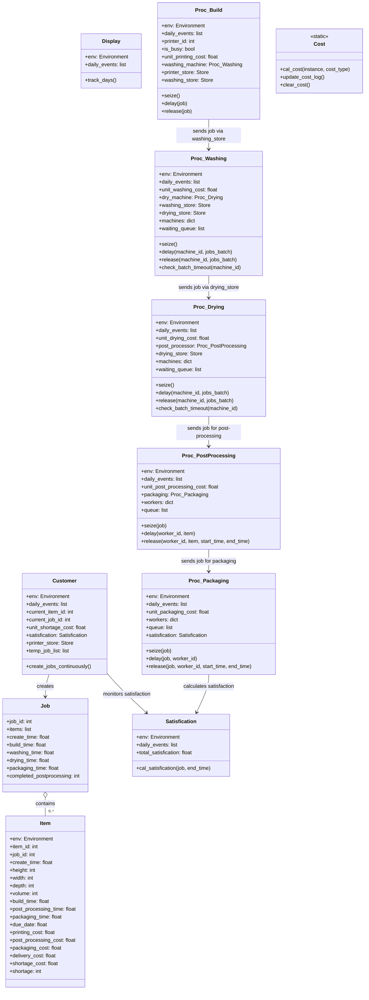

```mermaid
classDiagram
    class Display {
        +env: Environment
        +daily_events: list
        +track_days()
    }

    class Job {
        +job_id: int
        +items: list
        +create_time: float
        +build_time: float
        +washing_time: float
        +drying_time: float
        +packaging_time: float
        +completed_postprocessing: int
    }

    class Customer {
        +env: Environment
        +daily_events: list
        +current_item_id: int
        +current_job_id: int
        +unit_shortage_cost: float
        +satisfication: Satisfication
        +printer_store: Store
        +temp_job_list: list
        +create_jobs_continuously()
    }

    class Proc_Build {
        +env: Environment
        +daily_events: list
        +printer_id: int
        +is_busy: bool
        +unit_printing_cost: float
        +washing_machine: Proc_Washing
        +printer_store: Store
        +washing_store: Store
        +seize()
        +delay(job)
        +release(job)
    }

    class Proc_Washing {
        +env: Environment
        +daily_events: list
        +unit_washing_cost: float
        +dry_machine: Proc_Drying
        +washing_store: Store
        +drying_store: Store
        +machines: dict
        +waiting_queue: list
        +seize()
        +delay(machine_id, jobs_batch)
        +release(machine_id, jobs_batch)
        +check_batch_timeout(machine_id)
    }

    class Proc_Drying {
        +env: Environment
        +daily_events: list
        +unit_drying_cost: float
        +post_processor: Proc_PostProcessing
        +drying_store: Store
        +machines: dict
        +waiting_queue: list
        +seize()
        +delay(machine_id, jobs_batch)
        +release(machine_id, jobs_batch)
        +check_batch_timeout(machine_id)
    }

    class Proc_PostProcessing {
        +env: Environment
        +daily_events: list
        +unit_post_processing_cost: float
        +packaging: Proc_Packaging
        +workers: dict
        +queue: list
        +seize(job)
        +delay(worker_id, item)
        +release(worker_id, item, start_time, end_time)
    }

    class Proc_Packaging {
        +env: Environment
        +daily_events: list
        +unit_packaging_cost: float
        +workers: dict
        +queue: list
        +satisfication: Satisfication
        +seize(job)
        +delay(job, worker_id)
        +release(job, worker_id, start_time, end_time)
    }

    class Item {
        +env: Environment
        +item_id: int
        +job_id: int
        +create_time: float
        +height: int
        +width: int
        +depth: int
        +volume: int
        +build_time: float
        +post_processing_time: float
        +packaging_time: float
        +due_date: float
        +printing_cost: float
        +post_processing_cost: float
        +packaging_cost: float
        +delivery_cost: float
        +shortage_cost: float
        +shortage: int
    }

    class Cost {
        <<static>>
        +cal_cost(instance, cost_type)
        +update_cost_log()
        +clear_cost()
    }

    class Satisfication {
        +env: Environment
        +daily_events: list
        +total_satisfication: float
        +cal_satisfication(job, end_time)
    }

    Customer --> Job : creates
    Job o-- "0..*" Item : contains
    Proc_Build --> Proc_Washing : sends job via washing_store
    Proc_Washing --> Proc_Drying : sends job via drying_store
    Proc_Drying --> Proc_PostProcessing : sends job for post-processing
    Proc_PostProcessing --> Proc_Packaging : sends job for packaging
    Proc_Packaging --> Satisfication : calculates satisfaction
    Customer --> Satisfication : monitors satisfaction
```