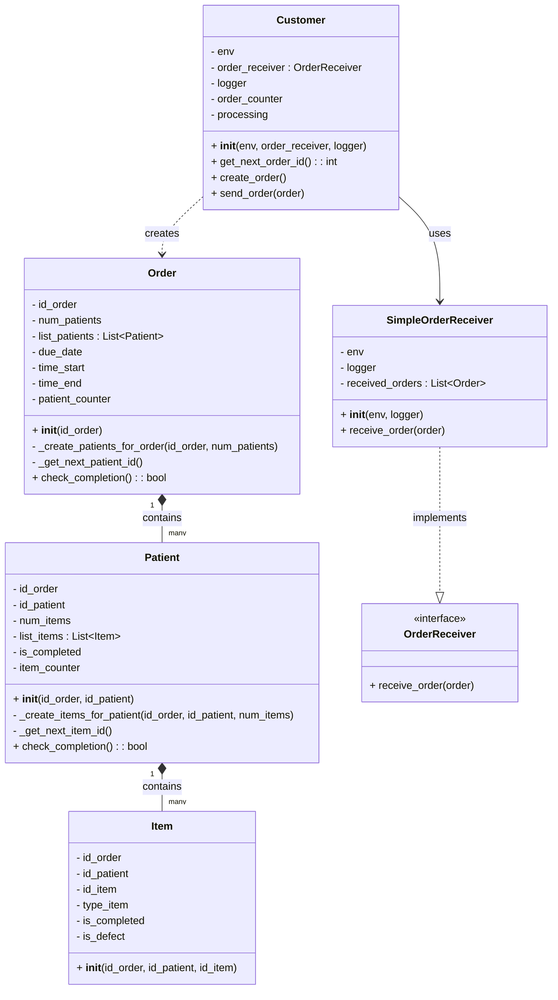

```mermaid
classDiagram
    class Item {
        - id_order
        - id_patient
        - id_item
        - type_item
        - is_completed
        - is_defect
        + __init__(id_order, id_patient, id_item)
    }

    class Patient {
        - id_order
        - id_patient
        - num_items
        - list_items : List~Item~
        - is_completed
        - item_counter
        + __init__(id_order, id_patient)
        - _create_items_for_patient(id_order, id_patient, num_items)
        - _get_next_item_id()
        + check_completion() : bool
    }

    class Order {
        - id_order
        - num_patients
        - list_patients : List~Patient~
        - due_date
        - time_start
        - time_end
        - patient_counter
        + __init__(id_order)
        - _create_patients_for_order(id_order, num_patients)
        - _get_next_patient_id()
        + check_completion() : bool
    }

    class OrderReceiver {
        <<interface>>
        + receive_order(order)
    }

    class SimpleOrderReceiver {
        - env
        - logger
        - received_orders : List~Order~
        + __init__(env, logger)
        + receive_order(order)
    }

    class Customer {
        - env
        - order_receiver : OrderReceiver
        - logger
        - order_counter
        - processing
        + __init__(env, order_receiver, logger)
        + get_next_order_id() : int
        + create_order()
        + send_order(order)
    }
    
    Customer ..> Order : creates
    Patient "1" *-- "many" Item : contains
    Order "1" *-- "many" Patient : contains
    Customer --> SimpleOrderReceiver : uses
    SimpleOrderReceiver ..|> OrderReceiver : implements
```