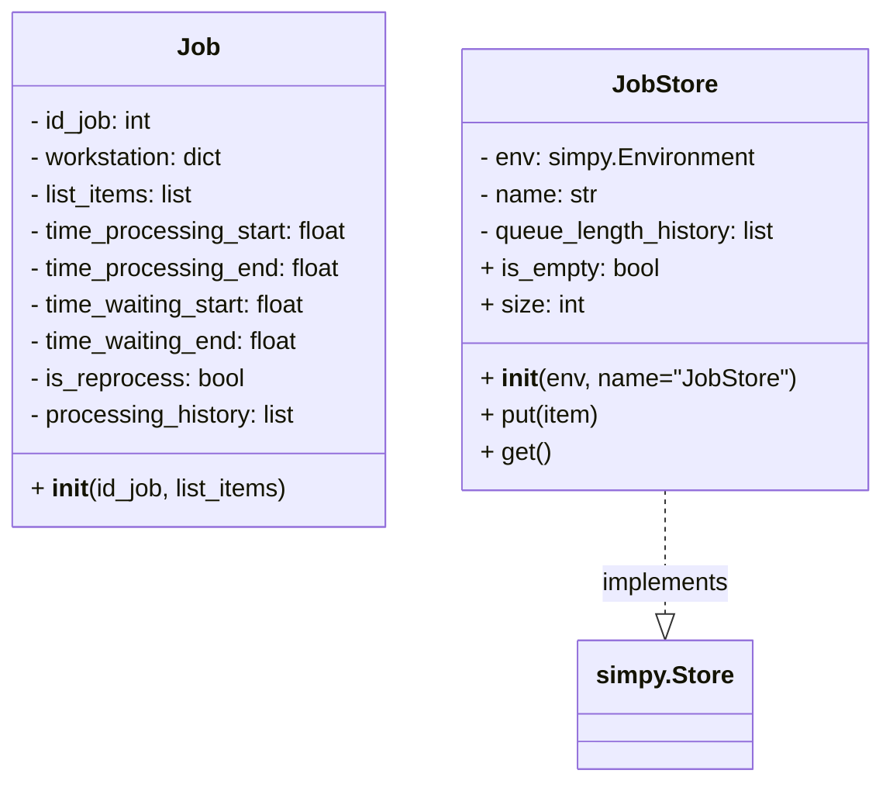

```mermaid
classDiagram
    class Job {
        - id_job: int
        - workstation: dict
        - list_items: list
        - time_processing_start: float
        - time_processing_end: float
        - time_waiting_start: float
        - time_waiting_end: float
        - is_reprocess: bool
        - processing_history: list
        + __init__(id_job, list_items)
    }

    class JobStore {
        - env: simpy.Environment
        - name: str
        - queue_length_history: list
        + __init__(env, name="JobStore")
        + put(item)
        + get()
        + is_empty: bool
        + size: int
    }

    JobStore ..|> simpy.Store : implements
```