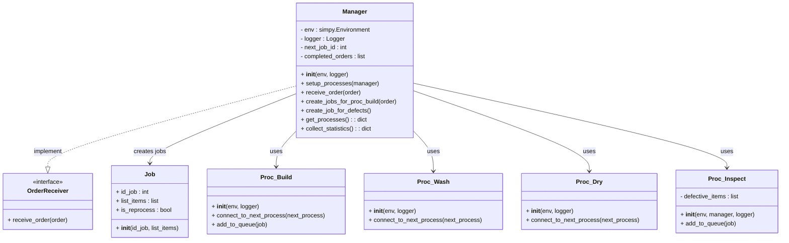

```mermaid
classDiagram
    class Manager {
         - env : simpy.Environment
         - logger : Logger
         - next_job_id : int
         - completed_orders : list
         + __init__(env, logger)
         + setup_processes(manager)
         + receive_order(order)
         + create_jobs_for_proc_build(order)
         + create_job_for_defects()
         + get_processes() : dict
         + collect_statistics() : dict
    }

    class OrderReceiver {
         <<interface>>
         + receive_order(order)
    }

    class Job {
         + id_job : int
         + list_items : list
         + is_reprocess : bool
         + __init__(id_job, list_items)
    }

    class Proc_Build {
         + __init__(env, logger)
         + connect_to_next_process(next_process)
         + add_to_queue(job)
    }

    class Proc_Wash {
         + __init__(env, logger)
         + connect_to_next_process(next_process)
    }

    class Proc_Dry {
         + __init__(env, logger)
         + connect_to_next_process(next_process)
    }

    class Proc_Inspect {
         - defective_items : list
         + __init__(env, manager, logger)
         + add_to_queue(job)
    }

    Manager ..|> OrderReceiver : implement
    Manager --> Job : creates jobs
    Manager --> Proc_Build : uses
    Manager --> Proc_Wash : uses
    Manager --> Proc_Dry : uses
    Manager --> Proc_Inspect : uses
```