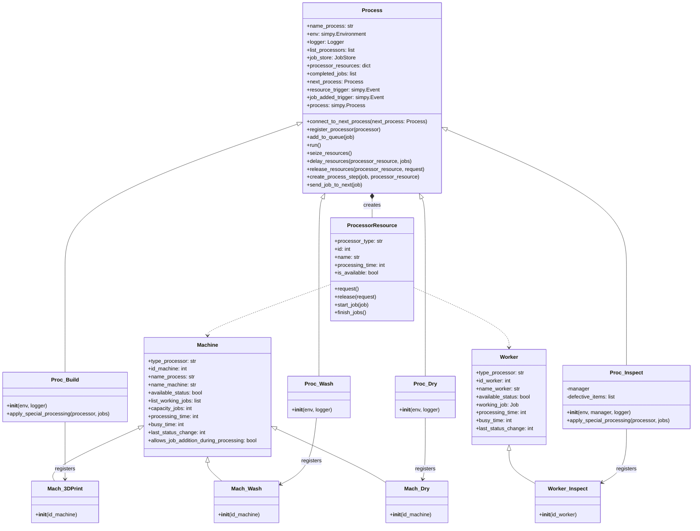

```mermaid
classDiagram
    %% [Base Processor] 클래스 (base_Processor.py)
    class Worker {
      +type_processor: str
      +id_worker: int
      +name_worker: str
      +available_status: bool
      +working_job: Job
      +processing_time: int
      +busy_time: int
      +last_status_change: int
    }
    class Machine {
      +type_processor: str
      +id_machine: int
      +name_process: str
      +name_machine: str
      +available_status: bool
      +list_working_jobs: list
      +capacity_jobs: int
      +processing_time: int
      +busy_time: int
      +last_status_change: int
      +allows_job_addition_during_processing: bool
    }
    class ProcessorResource {
      +processor_type: str
      +id: int
      +name: str
      +processing_time: int
      +is_available: bool
      +request()
      +release(request)
      +start_job(job)
      +finish_jobs()
    }

    %% [Specialized Processor] 클래스 (specialized_Processor.py)
    class Worker_Inspect {
      +__init__(id_worker)
    }
    class Mach_3DPrint {
      +__init__(id_machine)
    }
    class Mach_Wash {
      +__init__(id_machine)
    }
    class Mach_Dry {
      +__init__(id_machine)
    }

    %% 상속 관계 (specialized_Processor는 base_Processor를 상속)
    Worker <|-- Worker_Inspect
    Machine <|-- Mach_3DPrint
    Machine <|-- Mach_Wash
    Machine <|-- Mach_Dry

    %% [Process] 기본 클래스 (base_Process.py)
    class Process {
      +name_process: str
      +env: simpy.Environment
      +logger: Logger
      +list_processors: list
      +job_store: JobStore
      +processor_resources: dict
      +completed_jobs: list
      +next_process: Process
      +resource_trigger: simpy.Event
      +job_added_trigger: simpy.Event
      +process: simpy.Process
      +connect_to_next_process(next_process: Process)
      +register_processor(processor)
      +add_to_queue(job)
      +run()
      +seize_resources()
      +delay_resources(processor_resource, jobs)
      +release_resources(processor_resource, request)
      +create_process_step(job, processor_resource)
      +send_job_to_next(job)
    }

    %% [Specialized Process] 클래스 (specialized_Process.py)
    class Proc_Build {
      +__init__(env, logger)
      +apply_special_processing(processor, jobs)
    }
    class Proc_Wash {
      +__init__(env, logger)
    }
    class Proc_Dry {
      +__init__(env, logger)
    }
    class Proc_Inspect {
      +__init__(env, manager, logger)
      +apply_special_processing(processor, jobs)
      -manager
      -defective_items: list
    }

    %% 상속 관계 (specialized_Process는 Process를 상속)
    Process <|-- Proc_Build
    Process <|-- Proc_Wash
    Process <|-- Proc_Dry
    Process <|-- Proc_Inspect

    %% 연관 관계: specialized_Process 클래스는 각각 해당 specialized_Processor를 등록
    Proc_Build --> Mach_3DPrint : registers
    Proc_Wash  --> Mach_Wash : registers
    Proc_Dry   --> Mach_Dry : registers
    Proc_Inspect --> Worker_Inspect : registers

    %% 구성 관계: Process는 ProcessorResource를 생성하여 사용함
    Process *-- ProcessorResource : creates

    %% 의존 관계: ProcessorResource는 Worker와 Machine에 의존
    ProcessorResource ..> Worker
    ProcessorResource ..> Machine
```