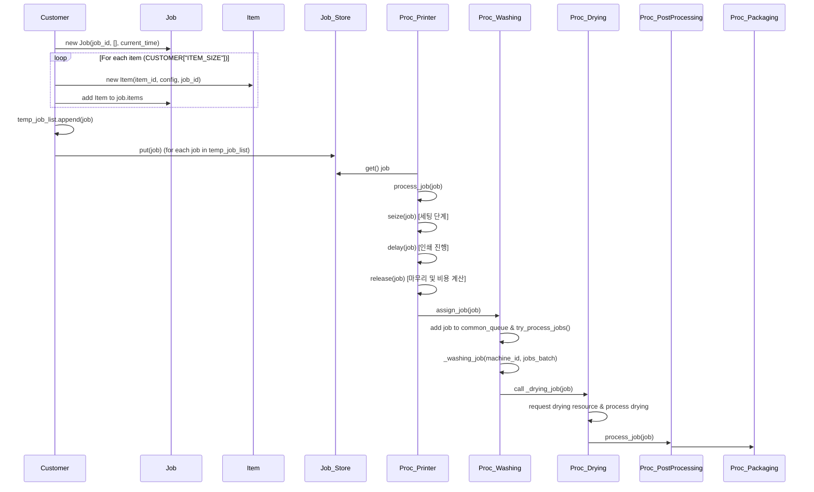

```mermaid
sequenceDiagram
    participant Cust as Customer
    participant Job as Job
    participant Item as Item
    participant Store as Job_Store
    participant Prin as Proc_Printer
    participant Wash as Proc_Washing
    participant Dry as Proc_Drying
    participant Post as Proc_PostProcessing
    participant Pack as Proc_Packaging

    %% Customer가 Job 생성 후, 내부에 Item들을 생성하여 추가
    Cust->>Job: new Job(job_id, [], current_time)
    loop For each item (CUSTOMER["ITEM_SIZE"])
        Cust->>Item: new Item(item_id, config, job_id)
        Cust->>Job: add Item to job.items
    end
    Cust->>Cust: temp_job_list.append(job)
    %% 배치 수가 충족되면 Job_Store에 전달
    Cust->>Store: put(job) (for each job in temp_job_list)
    
    %% Printer가 Job을 받아 처리 시작
    Prin->>Store: get() job
    Prin->>Prin: process_job(job)
    Prin->>Prin: seize(job) [세팅 단계]
    Prin->>Prin: delay(job) [인쇄 진행]
    Prin->>Prin: release(job) [마무리 및 비용 계산]
    
    %% 인쇄 완료 후 Washing으로 전달
    Prin->>Wash: assign_job(job)
    Wash->>Wash: add job to common_queue & try_process_jobs()
    Wash->>Wash: _washing_job(machine_id, jobs_batch)
    
    %% Washing 완료 후 Drying 단계 호출
    Wash->>Dry: call _drying_job(job)
    Dry->>Dry: request drying resource & process drying
    
    %% Drying 완료 후 PostProcessing로 전달
    Dry->>Post: process_job(job)
    
    %% 후처리 완료 후 Packaging으로 Job 전달
    Post->>Pack:
```