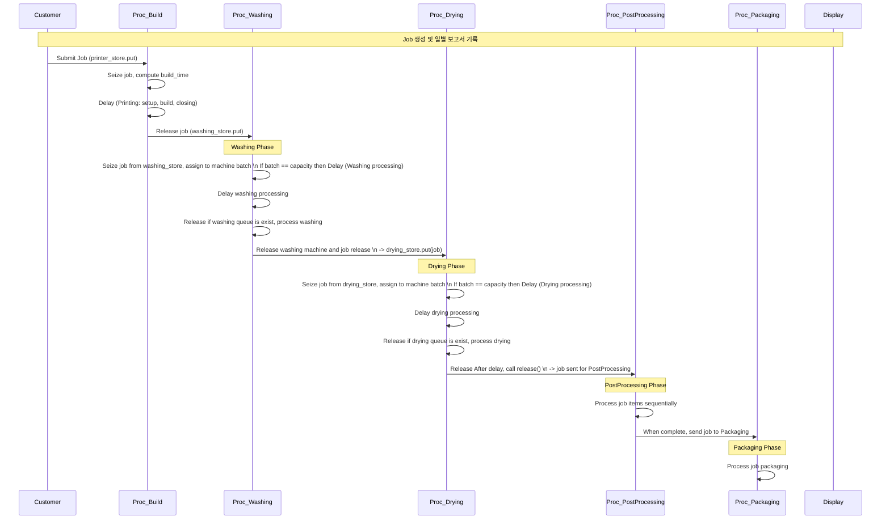

```mermaid
sequenceDiagram
    participant C as Customer
    participant P as Proc_Build
    participant W as Proc_Washing
    participant D as Proc_Drying
    participant PP as Proc_PostProcessing
    participant PA as Proc_Packaging
    participant Disp as Display
    
    Note over C,Disp: Job 생성 및 일별 보고서 기록
    C->>P: Submit Job (printer_store.put)
    P->>P: Seize job, compute build_time
    P->>P: Delay (Printing: setup, build, closing)
    P->>W: Release job (washing_store.put)
    Note over W: Washing Phase
    W->>W: Seize job from washing_store, assign to machine batch \n If batch == capacity then Delay (Washing processing)
    W->>W: Delay washing processing
    W->>W: Release if washing queue is exist, process washing
    W->>D: Release washing machine and job release \n -> drying_store.put(job)
    Note over D: Drying Phase
    D->>D: Seize job from drying_store, assign to machine batch \n If batch == capacity then Delay (Drying processing)
    D->>D: Delay drying processing
    D->>D: Release if drying queue is exist, process drying
    D->>PP: Release After delay, call release() \n -> job sent for PostProcessing
    Note over PP: PostProcessing Phase
    PP->>PP: Process job items sequentially
    PP->>PA: When complete, send job to Packaging
    Note over PA: Packaging Phase
    PA->>PA: Process job packaging
```